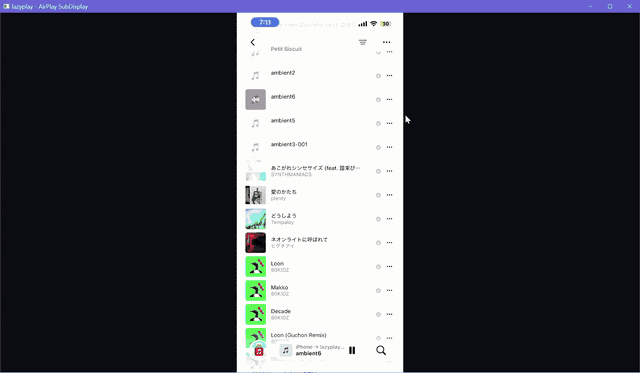

# lazyplay

*[日本語版はこちら / Japanese version](README.ja.md)*

Mirror your iPhone, iPad, or Mac screen and audio to a Windows PC with AirPlay.
lazyplay is a lightweight, native Windows receiver designed to reuse existing PCs,
including low-spec devices with compatible H.264 hardware decoding.

**[Download for Windows x64](https://github.com/kuwa72/lazyplay/releases/latest)**
Choose `lazyplay-win-x64.zip` under Assets, extract it, and run `lazyplay.exe`.
No build tools or sender-side app are needed.



This real iPhone demo shows portrait-screen mirroring and app navigation.
The original recording also contains audio; this GIF is silent and does not demonstrate audio quality or latency.
Use **Screen Mirroring** to send the screen and accompanying audio; media-only AirPlay casting is not the documented workflow.

## Features

- **GPU hardware decode (DXVA2/D3D11)**: H.264 is decoded on the GPU, not the CPU.
  No software-decode fallback by design.
- **Win32 + Direct3D11 native only**: no Electron/Qt or other heavy dependencies. A single portable `lazyplay.exe`.
- **Low latency**: minimizes the path from receive to render (decoded frames are presented immediately).
- **Audio playback**: decodes AirPlay mirroring audio (AAC-ELD / 44.1 kHz stereo) and plays it back via WASAPI.
- **No pairing required**: feature bit 27 is disabled, so the Mac/iPhone connects without a PIN prompt.
- **Prevents sleep**: keeps the host awake and the display on while mirroring.

## Usage

1. Launch `lazyplay.exe` to start in fullscreen (use `-window` to start windowed instead).
2. Connect the sender and Windows PC to the same trusted local network:
   - **iPhone / iPad**: open Control Center → Screen Mirroring → `lazyplay-display`.
   - **Mac**: open Control Center → Screen Mirroring → `lazyplay-display`.
   Your screen appears in the Windows window, with accompanying audio played through the PC's selected output device.
3. Tap / right-click / touch-and-hold opens a control menu (Toggle fullscreen / Move to next display / Exit). You can also quit with `Esc`/`Q`.
4. `Alt+Enter` toggles fullscreen/windowed mode; `Shift+Alt+Enter` moves fullscreen to the next display.

**Firewall**: AirPlay uses inbound TCP 5000/7000 (and mDNS UDP 5353). If a
Windows Firewall prompt appears on first launch, allow access. If your
Mac/iPhone can see the device but cannot connect, check your firewall
settings.

**Recommended**: in Control Panel, go to "Windows Defender Firewall" →
"Allowed apps" → "Change settings" / "Allow another app" and add
`lazyplay.exe`.

### Troubleshooting

| Symptom | What to check |
|---|---|
| `lazyplay-display` does not appear | Keep lazyplay running and both devices on the same trusted LAN. Guest Wi-Fi/client isolation, VPN routing or blocked mDNS can prevent discovery. |
| The device appears but cannot connect | Allow the actual `lazyplay.exe` through Windows Firewall on the trusted/private network. Discovery alone does not prove the streaming ports are reachable. Do not disable the firewall. |
| Connected, but the picture stays black | Check the startup log for `Hardware decoder unavailable` and verify D3D11/H.264 hardware decoding support and GPU drivers. Protected content may be blacked out by the sender. |
| Picture works, but no sound | Check sender and Windows volume, mute status, and Windows' selected playback device. Use Screen Mirroring, not a media-only AirPlay destination. |
| Playback stutters | Check local-network signal/congestion. After ending the current session, try restarting with `-res 720p -fps 30`; this is a troubleshooting option, not a guaranteed fix. |

No PIN pairing or access control is implemented; use lazyplay only on a trusted LAN, not public or guest networks.
For a failure or a successful setup, [open an issue](https://github.com/kuwa72/lazyplay/issues/new/choose)
and include the receiver version, sender model/OS, Windows build, GPU and what you tried.
Remove personal information from screenshots and logs before sharing them.

### Command-line options

| Option | Description | Default |
|---|---|---|
| `-name <name>` | AirPlay device name shown to senders | `lazyplay-display` |
| `-fps <30\|60>` | Maximum frame rate | `30` |
| `-res <720p\|1080p>` | Receive resolution | `1080p` |
| `-vsync <0\|1>` | Vertical sync | `1` |
| `-window` | Start windowed instead of fullscreen | off (fullscreen is the default) |

* Rendering is Per-Monitor-V2 DPI aware, so the video is drawn 1:1 to
  physical pixels even under Windows display scaling (e.g. 125%). When the
  default fullscreen start matches the panel resolution, this gives a
  dot-by-dot display (windowed mode loses some area to the border/title bar).
* Designed for keyboardless tablet use: use tap / right-click / touch-and-hold
  to open the control menu. The mouse cursor is also hidden in fullscreen.
* DRM-protected content (e.g. Netflix) is not included in the mirrored
  image — this is blacked out on the macOS side by Apple's own restriction,
  the same limitation that applies to Apple TV.

## Build

On Windows with MinGW-w64 (gcc/g++) / MSYS2 (UCRT64):

```
make            # builds lazyplay.exe (downloads and builds FFmpeg on first run)
make test       # unit tests (SHA-512 / AES-CTR / AES-CBC / bplist / WASAPI)
```

Integration tests (real H.264 stream decode & render verification / protocol E2E):

```
./test/test_all.exe decode test/test.h264
./lazyplay.exe &                      # launch in a separate process
./test/test_all.exe e2e 127.0.0.1 test/test.h264
```

```
./test/test_all.exe wasapi   # simple playback test; you should hear a 440 Hz tone
```

MSVC does not support building FFmpeg from source, so MSYS2 UCRT64 +
`make` is recommended. `CMakeLists.txt` includes automatic FFmpeg builds
for MinGW-w64.

## Requirements

- Windows 10 / 11 (x64)
- A GPU with D3D11 + H.264 hardware decode support (e.g. Intel HD Graphics)
- Screen mirroring from iOS / iPadOS / macOS (same local network, mDNS reachability required)
- iPhone screen-and-audio casting has been reported working on the Windows PC listed below; exact iPhone model and iOS version are not yet recorded.
- Mac extended-display mode and other device/OS combinations are not validated by the iPhone demo.

## Observed resource usage

On October 5, 2026, the owner confirmed an active iPhone screen-and-audio cast on an
ASUS ROG Zephyrus G14 (Ryzen 9 5900HS, 16 logical processors, 31.4 GiB RAM,
Windows 11 Home build 26200; system-reported GPU: AMD Radeon Graphics).
Read-only sampling of the existing process collected 29 samples over 30.134 seconds.

| Process metric | Average | Maximum sampled |
|---|---|---|
| CPU, normalized to the whole machine | 0.463% | 1.124% |
| Working set (resident memory) | 79.33 MiB | 79.73 MiB |
| Private bytes (private committed memory) | 105.31 MiB | 105.83 MiB |

This is one short observation, not an Atom-device or comparative benchmark.
The running binary's release version, sender model/iOS version and negotiated resolution/FPS were not recorded.
Latency, actual FPS, GPU utilization and VRAM were not measured. The 50 MB memory target in the requirements is not met by this observation.
The [measurement data and binary hash](assets/windows-mirroring-2026-10-05.json) are included for traceability.

To sample your own running receiver from a trusted local Windows checkout:

```powershell
powershell.exe -NoProfile -File .\scripts\Measure-Lazyplay.ps1 -Seconds 30 -Workload mirroring
```

Use `-Workload idle` for a separate idle observation, or `-ProcessId <id>` if several instances are running.
The script only reads process/system metrics and prints JSON; it does not restart the receiver or change the execution policy.
If your policy blocks an unsigned script or a network-share path, use your normal approved script-execution workflow rather than weakening the policy.

## Technical overview

- mDNS announcement (`_airplay._tcp` / `_raop._tcp`), RTSP+plist session,
  FairPlay SAP key exchange, AES-128-CTR video decryption, NTP timing — the
  protocol implementation is based on [UxPlay](https://github.com/FDH2/UxPlay) / RPiPlay.
- The FairPlay part vendors UxPlay's bundled `playfair` (`src/playfair/`).
- Audio is RTP/UDP (stream type 96), decrypted with AES-128-CBC, decoded
  from AAC-ELD to PCM by FFmpeg's native AAC decoder (LGPL), and played
  back in WASAPI shared mode.

## License

GPLv3 — because this project vendors `playfair` (FairPlay SAP), the whole
project is published under GPLv3. See [LICENSE](LICENSE).

FFmpeg is downloaded and built into `thirdparty/` on first build.
`libavcodec`'s native AAC decoder is LGPL-2.1-or-later, which can be linked
against GPLv3 code.
